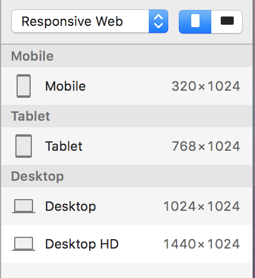

# What is Responsive Web Design?
Responsive Web Design makes your web page look good on all devices (desktops, tablets, and phones).
Responsive Web Design is about using HTML and CSS to resize, hide, shrink, enlarge, or move the content to make it look good on any screen. <br/>

The reason why responsive matters is not only to make webpage look good on all devices(mobile users increasing dramatically), but also make sure users will have comfortable visual experience when accessing your website with a not-full-width browser. <br/>

We have 3 tips get started wit responsive web design.
## 1. Breakpoints = Screens Needed 

Breakpoints are the point a which your sites content will respond to provide the user with the best possible layout to consume the information.
For designers, that is the point when we need a screen. New designers  can using the default setting in Sketch. But if you have a specific device your want to target, or if your development team is using a specific framework like Bootstrap, things will be different.<br/>

 <br/>
## 2. Transition Between Breakpoints

Designing five version of the website doesn’t mean the work is done. As a designer, we also need to think of how the website will look like when the size is between two breakpoints. As mentioned before, we can control the size of a certain mobile product, but we cannot do the same for the browser.

* Position <br/>
Think of how the elements will position while resizing. For example, what Google does is to always centre the search bar and thumbnail, also fix the width of each thumbnail.

* Size <br/>
When resizing Dribbble’s website, the thumbnails remain the same size, it reduces the number of the thumbnail on each row in order to fit smaller size.

* Interaction <br/>
Hamburger menu is pretty popular now for smaller screens. Stripe uses a tab menu in the larger screen but a drop down in smaller screen in order to save space.

* Image & Text <br/>
These two doesn’t need a lot of tweaks for gradually transition as themselves are naturally flow to fit the screen, however, we need to think of showing different images in different screens, and offer different text sizes for readability.

When we start doing the design, should we start with the smallest one or the biggest one? Mobile first is highly recommended because it can make website load faster on small devices. <br/>
To explain this, we need to understand how developers make the website responsive: the use Media Query in CSS to do that. CSS loads from top to bottom, which means if we put the CSS for mobile first, mobile phone will load the corresponding CSS at the first place while computers often has a more stable Internet access, and they can go all the way to the end to find the CSS for larger screens.
<br/>
<br/><br/>
In order to calculate the proportions for each page element, you must divide the target element by its context. Currently, the best way to do this is to first create a high fidelity mockup in a pixel based imaged editor, like Photoshop. With your high fidelity mockup in hand, you can measure a page element and divide it by the full width of the page. For example, if your layout is a typical size like 960 pixels across, then this would be your “container” value. Then, let’s say that our target element is some arbitrary value, like 300 pixels wide. If we multiply the result by 100, we get the percentage value of 31.25% which we can apply to the target element. Here’s the math: <br/>

```    
300 / 960 = 0.3125 or 31.25%
```
If your values don’t work out so neatly, and you get some floating point value with many numbers after the decimal, don’t round the value! We humans may enjoy nice neat numbers and making our code look pretty, but your computer (and the final look of your design) will benefit from the seemingly excessive mathematical precision.

Fluid grids are a very important part of creating a responsive design, but they can only take us so far. When the width of the browser becomes too narrow, the design can start to severely break down. For example, a complex three-column layout isn’t going to work very well on a small mobile phone. Fortunately, responsive design has taken care of this problem by using media queries.


## Media Queries

The second part of responsive design is CSS3 media queries, which currently enjoy decent support across many modern browsers. If you’re not familiar with CSS3 media queries, they basically allow you to gather data about the site visitor and use it to conditionally apply CSS styles. For our purposes, we’re primarily interested in the min-width media feature, which allows us to apply specific CSS styles if the browser window drops below a particular width that we can specify. If we wanted to apply some styling to mobile phones, our media query might look something like the following.

```css 
@media screen and (min-width: 480px) {

  .content {
    float: left;
  }

  .social_icons {
    display: none
  }

  // and so on...

}
```
Using a series of media queries like this, we can work our way up towards larger resolutions. The set of pixel widths I recommend targeting are as follows:

* 320px
* 480px
* 600px
* 768px
* 900px
* 1200px

From a more practical perspective, the resolutions that a design targets will be based on the resolutions of the people using that design, time and budget constraints, highly contextual situations, and so on. In summary, when deciding what resolutions to target, you should use your judgement. Targeting more resolutions is going to take more time, and assuming you’re not an immortal being with unlimited time, that effort should be spent carefully. <br/>
<br/>

Hopefully this article helped, see you next blog post 👩🏻‍💻🤗