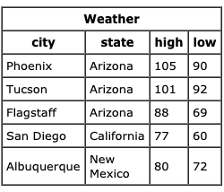
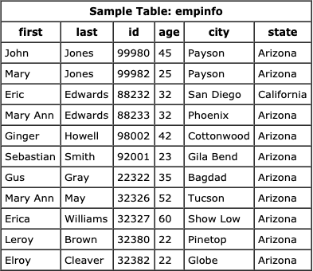

# WHAT IS SQL


SQL stands for Structured Query Language. SQL is used to communicate with a database. According to ANSI (American National Standards Institute), it is the standard language for relational database management systems. SQL statements are used to perform tasks such as update data on a database, or retrieve data from a database. Some common relational database management systems that use SQL are: Oracle, Sybase, Microsoft SQL Server, Access, Ingres, etc. Although most database systems use SQL, most of them also have their own additional proprietary extensions that are usually only used on their system. However, the standard SQL commands such as "Select", "Insert", "Update", "Delete", "Create", and "Drop" can be used to accomplish almost everything that one needs to do with a database.

## Table Basics

A relational database system contains one or more objects called tables. The data or information for the database are stored in these tables. Tables are uniquely identified by their names and are comprised of columns and rows. Columns contain the column name, data type, and any other attributes for the column. Rows contain the records or data for the columns. Here is a sample table called "weather". city, state, high, and low are the columns. The rows contain the data for this table: <br/>

 <br/>

## Selecting Data

The select statement is used to query the database and retrieve selected data that match the criteria that you specify. Here is the format of a simple select statement:

```sql
select "column1"
  [,"column2",etc] 
  from "tablename"
  [where "condition"];
  [] = optional
```

The column names that follow the select keyword determine which columns will be returned in the results. You can select as many column names that you'd like, or you can use a "*" to select all columns.

The table name that follows the keyword from specifies the table that will be queried to retrieve the desired results.

The where clause (optional) specifies which data values or rows will be returned or displayed, based on the criteria described after the keyword where.

Conditional selections used in the where clause:

* ```=```	Equal
* ```>``` Greater than
* ```<``` Less than
* ```>=``` Greater than or equal
* ```<=```	Less than or equal
* ```<>```	Not equal to

The LIKE pattern matching operator can also be used in the conditional selection of the where clause. Like is a very powerful operator that allows you to select only rows that are "like" what you specify. The percent sign "%" can be used as a wild card to match any possible character that might appear before or after the characters specified. For example:

```sql
select first, last, city
   from empinfo
   where first LIKE 'Er%';
```

This SQL statement will match any first names that start with 'Er'. Strings must be in single quotes.

Or you can specify,

```sql
select first, last
   from empinfo
   where last LIKE '%s';
```
This statement will match any last names that end in a 's'.

```sql
select * from empinfo
   where first = 'Eric';
```
This will only select rows where the first name equals 'Eric' exactly. <br/> <br/>
 <br/>

## Creating Tables

The create table statement is used to create a new table. Here is the format of a simple create table statement:

```sql
create table "tablename"
("column1" "data type",
 "column2" "data type",
 "column3" "data type");
```
Example:

```sql
create table employee
(first varchar(15),
 last varchar(20),
 age number(3),
 address varchar(30),
 city varchar(20),
 state varchar(20));
```

To create a new table, enter the keywords create table followed by the table name, followed by an open parenthesis, followed by the first column name, followed by the data type for that column, followed by any optional constraints, and followed by a closing parenthesis. It is important to make sure you use an open parenthesis before the beginning table, and a closing parenthesis after the end of the last column definition. Make sure you seperate each column definition with a comma. All SQL statements should end with a ";".

The table and column names must start with a letter and can be followed by letters, numbers, or underscores - not to exceed a total of 30 characters in length. Do not use any SQL reserved keywords as names for tables or column names (such as "select", "create", "insert", etc).

Data types specify what the type of data can be for that particular column. If a column called "Last_Name", is to be used to hold names, then that particular column should have a "varchar" (variable-length character) data type.

Here are the most common Data types:
* char(size): Fixed-length character string. Size is specified in parenthesis. Max 255 bytes.

* varchar(size): Variable-length character string. Max size is specified in parenthesis.

* number(size): Number value with a max number of column digits specified in parenthesis.

* date: Date value

* number(size,d): Number value with a maximum number of digits of "size" total, with a maximum number of "d" digits to the right of the decimal.

What are constraints?<br/>
 When tables are created, it is common for one or more columns to have constraints associated with them. A constraint is basically a rule associated with a column that the data entered into that column must follow. For example, a "unique" constraint specifies that no two records can have the same value in a particular column. They must all be unique. The other two most popular constraints are "not null" which specifies that a column can't be left blank, and "primary key". A "primary key" constraint defines a unique identification of each record (or row) in a table. 

 ## Inserting into a Table

 The insert statement is used to insert or add a row of data into the table.

To insert records into a table, enter the key words insert into followed by the table name, followed by an open parenthesis, followed by a list of column names separated by commas, followed by a closing parenthesis, followed by the keyword values, followed by the list of values enclosed in parenthesis. The values that you enter will be held in the rows and they will match up with the column names that you specify. Strings should be enclosed in single quotes, and numbers should not.

```sql
insert into "tablename"
 (first_column,...last_column)
  values (first_value,...last_value);
```
Example:

```sql
insert into employee
  (first, last, age, address, city, state)
  values ('Luke', 'Duke', 45, '2130 Boars Nest', 
          'Hazard Co', 'Georgia');
```
Note: All strings should be enclosed between single quotes: 'string'

## Updating Records

The update statement is used to update or change records that match a specified criteria. This is accomplished by carefully constructing a where clause.

```sql
update "tablename"
set "columnname" = 
    "newvalue"
 [,"nextcolumn" = 
   "newvalue2"...]
where "columnname" 
  OPERATOR "value" 
 [and|or "column" 
  OPERATOR "value"];

 [] = optional
```

Example:

```sql
update phone_book
  set area_code = 623
  where prefix = 979;

update phone_book
  set last_name = 'Smith', prefix=555, suffix=9292
  where last_name = 'Jones';

update employee
  set age = age+1
  where first_name='Mary' and last_name='Williams';
```

## Deleting Records

The delete statement is used to delete records or rows from the table.

```sql
delete from "tablename"

where "columnname" 
  OPERATOR "value" 
[and|or "column" 
  OPERATOR "value"];

[ ] = optional
```
Examples:

```sql
delete from employee;
```
Note: if you leave off the where clause, all records will be deleted!

```sql
delete from employee
  where lastname = 'May';

delete from employee
  where firstname = 'Mike' or firstname = 'Eric';
```
To delete an entire record/row from a table, enter "delete from" followed by the table name, followed by the where clause which contains the conditions to delete. If you leave off the where clause, all records will be deleted.

## Drop a Table

The drop table command is used to delete a table and all rows in the table.

To delete an entire table including all of its rows, issue the drop table command followed by the tablename. drop table is different from deleting all of the records in the table. Deleting all of the records in the table leaves the table including column and constraint information. Dropping the table removes the table definition as well as all of its rows.

```sql
drop table "tablename"
```
Example:

```sql
drop table myemployees_ts0211;
```

Thank you for reading. See you next blog post 👩🏻‍💻💙
